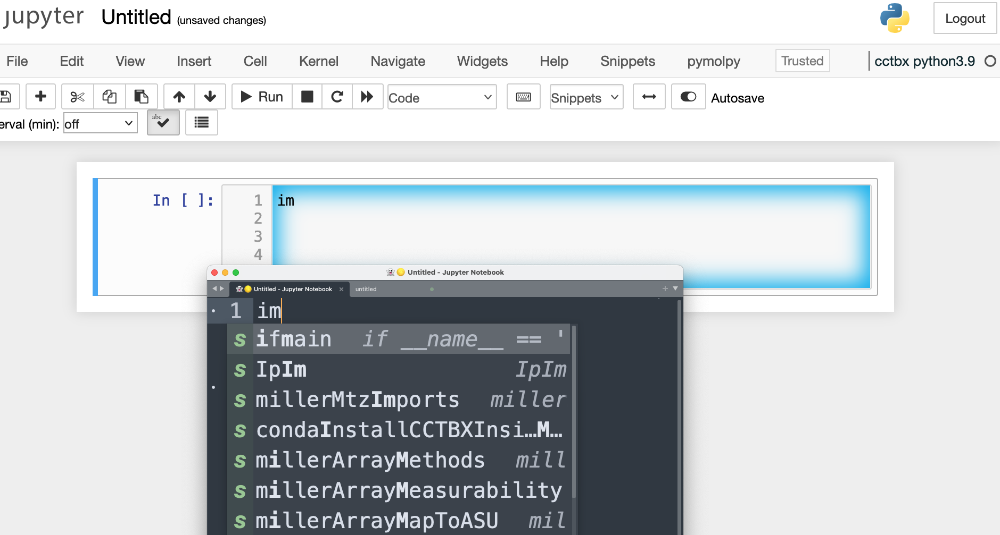
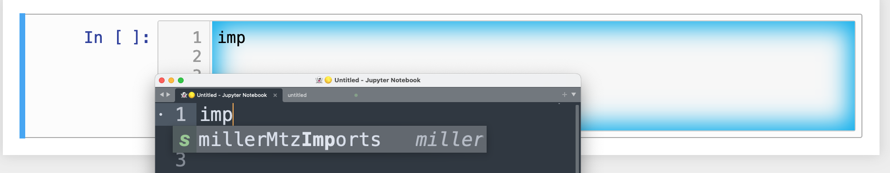
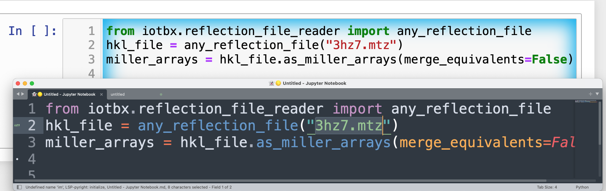

# cctbxsnips for the SublimeText3 text editor

## CCTBX

[CCTBX](https://github.com/cctbx/cctbx_project) is the Computational Crystallography Toolbox. 
Its development is based at Berkeley-Lawrence National Laboratory.
It provides code for computations with diffraction data and atomic coordinates of proteins and small molecules.
It has C++ and Python ports.
It is available in Anaconda in the conda-forge channel as cctbx-base for python3.8 through 3.11 for Windows, macOS, and Linux.

### Blaine's cctbx install protocol

I assume that Anaconda has already been installed. We will create a conda env specifically for CCTBX. CCTBX has numerous dependencies; I find it best to keep CCTBX in an isolated environment. We will also create the correpsonding Jupyter notebook kernel while we are at it. 

Execute one line at a time: Wait for the execution to finish before executing the next line.

```bash
conda create --name cctbx39 python=3.9
conda activate cctbx39
conda install -c conda-forge cctbx-base -y
conda install ipykernel -y
python -m ipykernel install --user --name cctbx39 --display-name "cctbx python3.9"
```

The second to last command triggers the installation of Jupyter in the cctbx39 env.
The last command creates and installs the Jupyter kernel in `~/Library/Jupyter/kernels/cctbx39` on macOS.
Jupyter will display "cctbx python3.9" for this kernel in the pulldown list of kernels.

Replace the *3.9* or *39* above with whatever version of Python you want to use (between 3.8, 3.9, 3.10, or 3.11).
Earlier versions of CCTBX used Python3.7. 
These older versions are also available on Anaconda.


## The problems that this repo addresses

1. **Facilitation of code reuse**. The use of code snippets can save time by reusing existing code. The presence of tab stops in code snippets can help ensure that all parameters that need customization to a new problem are considered. Thus, tab stops can reduce subsequent debugging.

2. **Use of SublimeText3 to edit Jupyter and Colab code and markdown cells**. The existing snippet formats for Jupyter and Colab notebooks do not support tab triggers and tab stops: These are standard features of code snippet systems in most text editors. We can overcome these limitations by sending the active code cell to SublimeText via the GhostText extension for the browser.


## Installation

1. Install the snippets for Sublime Text 3.

The snippets are stored in separate files. 
Each file has the extension *.sublime-snippet*.
For all operating systems (Mac, Windows, Linux), go to `Preferences→Browse Packages...→User→snippets`. 
You may need to create the subdirectory called snippets. 
Copy and paste cctbxsnips-SublimeText3 into the snippets folder.

To acheive the same end from the terminal in macOS, do the following steps:

- Create the snippets directory in the Sublime Text3 folder: `mkdir ~/Library/Application\ Support/Sublime\ Text\ 3/Packages/User/snippets/Python`
- Add the snippet files to the Sublime Text 3 folder:

```bash
cp -a ./cctbxsnips-SublimeText3/st3cctbxsnips/* ~/Library/Application\ Support/Sublime\ Text\ 3/Packages/User/snippets/Python/. 
```   

SublimeText should be able to find snippets stored in subfolders of the `~/Library/Application\ Support/Sublime\ Text\ 3/Packages/User` folder.
As a last resort, you can store the snippet files in `~/Library/Application\ Support/Sublime\ Text\ 3/Packages/User`.

**Notes**

- The scope for the snippets was set to `source.python`. As a result, the snippets will only appear when a Python file is being edited. 
- The testCCTBXpython*.* series of snippets are actually bash scripts. They have the source.python scope so that they can be discovered in Jupyter notebooks with an active CCTBX kernel.

2. **Optional** If you want to use these snippets from Sublime Text 3 to edit live cells in Jupyter or Colab notebooks, install [GhostText browser extension](https://ghosttext.fregante.com/) in your browser and the [GhostText package for SublimeText3](https://packagecontrol.io/packages/GhostText). 
The upside of using GhostText with Sublime Text 3 is that this was the text editor for which GhostText was originally developed.
The GhostText package for Sublime Text 3 can be installed from within Sublime Text 3 via `Tools --> Command Palette` and select **Package Control: Install Package**. Then enter **GhostText**.

## Example of Sublime Text Editing a code cell in Jupyter Notebook

*Note* After opening a connection from a code cell in a Jupyter Notebook (light-theme) to Sublime Text (dark-theme), a markdown document will appear in Sublime Text. You will need to manually change the scope to Python by clicking on the markdown text in the lower righthand corner (see second image below). This will open a menu with a list of programming languages. Select **python**. Now you will be able to access the snippets.

The image below shows popup menu of snippets and autocompletion text that appear in SublimeText by entering two letters in found in the list of code fragments.

<p align="center"></p>

The image below shows how entering a third letter `p` (e.g., "imp") of the word *import* narrowed the list of snippets to *millerMtzImports*. The "imp" letters appear in the Juptyer notebook instantly, but the snippets are only accessed from Sublime Text. The snippet is in the miller array family of snippets. The use of the miller submodule is an older approach to importing mtz files into CCTBX.

<p align="center"></p>


The image below shows the result of hitting tab after selecting the desired snippet in the list of snippets. The highlighted text in the snippet in SublimeText is a placeholder value. This placeholder at the only nontrivail tab stop in the snippet (There is another tab stop at the bottom of the snippet that moves the cursor to the start of a new line. Enter the desired mtz filename by typing over the placeholder value to customize for your use.

<p align="center"></p>


## Related repositories

- [Jupyterlab cctbx snippets](https://github.com/MooersLab/jupyterlabcctbxsnips) CCTBX snippets for JupyterLab with the jupyterlab-snippets extension or the jupyterlab-snippets-mutlimenus extension.
- [Jupyterlab cctbx plus snippets](https://github.com/MooersLab/jupyterlabcctbxsnipsplus) The variant of the jupyterlabcctbxsnips library with comments to guide editing of the snippets.
- [Colab cctbx snippets](https://github.com/MooersLab/colabcctbxsnips) Colab snippets.
